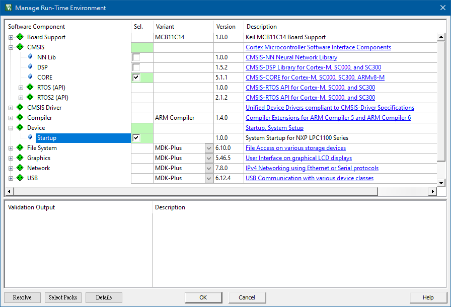

# keil_lpc111x
  This is the start point we get, when we create a new keil project and just select the CMSIS CORE and Device Startup software component. 
  Keil automatically generate startup codes (startup_LPC11xx.s and startup_LPC11xx.c reside in RTE\Device\LPC1114FN28_102) for us.
  
Screenshot

  
  
  
